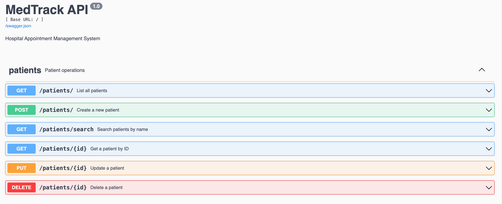
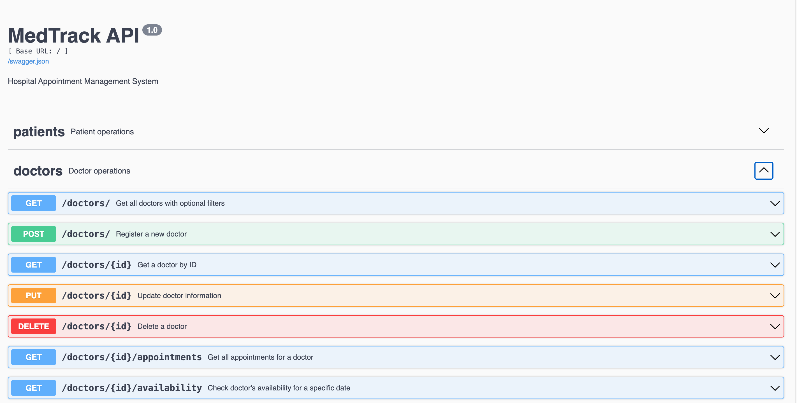
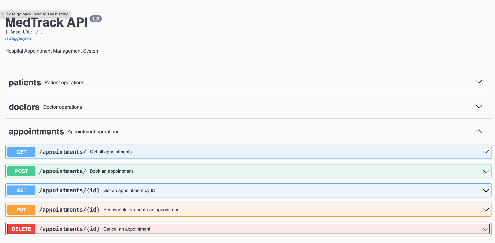

# MedTrack
## Description
A RESTful API built with Flask-RESTX and MySQL for managing hospital appointments, patients, and doctors. This API allows patients to book appointments online without physically visiting the hospital. It fully supports CRUD operations for patients, doctors, and appointments

## Built With
- **Backend Framework:** Flask 3.1.3  
- **API:** Flask-RESTX 1.3.2  
- **Database:** MySQL  
- **Database Connector:** mysql-connector-python 8.0+  
- **Testing:** unittest (Python standard library)
  
## Features
- Manage patients (Create, Read, Update, Delete)
- Manage doctors (Create, Read, Update, Delete)
- Book, update, and cancel appointments
- Check doctor availability
- JSON-based API responses
- Validation for scheduling conflicts

## Getting Started

1. Clone the repository:
```
git clone https://github.com/AdelabuAderonke/MedTrack.git
cd MedTrack
```
2. Create a virtual environment
 ```
  python -m venv venv
  source venv/bin/activate  #  venv\Scripts\activate -for windows
  ```
3. Install the dependencies
  ```
  pip install -r requirements.txt
  ```
4. Set up and connect the database
  ```
   python conn_database.py
  ```
5. Run the application
   ```
   python run.py
   ```
6. API documentation access(remember to add the /docs)
   ```
   http://127.0.0.1:5000/docs
   ```
   ### Patient
   
   ### Doctor
    
   ### Appointment
    
   
7. Testing
   ```
   python -m unittest tests.test_database
   ```

## Acknowledgments

- Thanks to [Coding black Female](https://codingblackfemales.com/) for the amazing Bootcamp.
- Inspired by tutorials from CBF Academy and Real Python.
- Special thanks to the bootcamp tutors and my mentor for guidance.
  
## Future Work
- User Authentication and Authorisation (Admin, Doctor, Patient)
- Appointment Reminders via Email or SMS
- Search and Filter Appointments by Date, Doctor, or Status
- Add a Frontend application for user interaction
